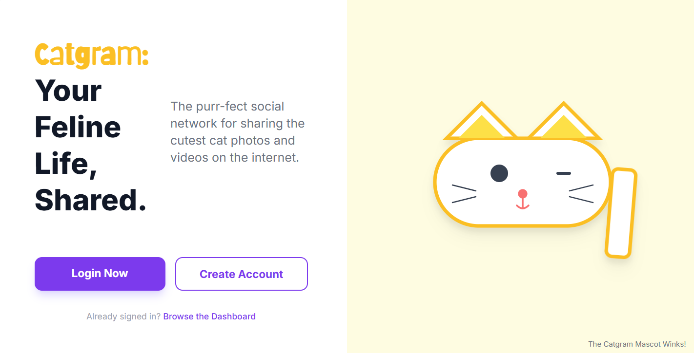

# Catgram — Mini Social App (formerly AuthBoard)

Welcome to Catgram — a small, server-rendered PHP application that demonstrates a minimal MVC architecture with user authentication, posts (with image uploads), search, and a simple dashboard.



Quick highlights:

- Lightweight MVC (no full framework)
- Server-rendered views (PHP)
- Uses Tailwind CSS + DaisyUI via CDN for fast UI styling
- MySQL database for persistence

## Features

- User registration and login (bcrypt password hashing)
- Session-based authentication
- Create posts with optional image upload (stored in `public/uploads/`)
- Dashboard showing recent posts (with author info)
- Search (posts and users)
- Email sending (PHPMailer is included in `vendor/` — used for welcome emails)

## Project structure (important folders)

- `public/` — web root, `index.php`, `assets/` (CSS, images), and `uploads/` (user uploads)
- `app/Core/` — framework glue: Router, Controller base, Session helper, Mailer
- `app/Controllers/` — controllers that handle routes (Auth, Dashboard, Post, Search)
- `app/Models/` — database access (PDO) for `User` and `Post`
- `app/Views/` — PHP view templates (includes `layout.php` and page templates)
- `sql/` — `schema.sql` with the database schema
- `docs/` — developer docs (how-catgram-works, login, register, post, dashboard, search, design)

## How Catgram works (brief)

1. `public/index.php` boots the app, loads environment variables, starts the session, and registers routes.
2. Routes map to controller methods (`App\\Controllers`). Controllers call model methods and render views.
3. Models (in `app/Models`) use PDO prepared statements to query the MySQL database.
4. Views are simple PHP templates that include `layout.php`. Styling is done with Tailwind + custom CSS in `public/assets/style.css`.

## Database (quick)

See `sql/schema.sql`. Main tables:

```sql
CREATE TABLE users (
  id INT UNSIGNED AUTO_INCREMENT PRIMARY KEY,
  name VARCHAR(100) NOT NULL,
  email VARCHAR(150) NOT NULL UNIQUE,
  password VARCHAR(255) NOT NULL,
  created_at TIMESTAMP DEFAULT CURRENT_TIMESTAMP
);

CREATE TABLE posts (
  id INT UNSIGNED AUTO_INCREMENT PRIMARY KEY,
  user_id INT UNSIGNED NOT NULL,
  content TEXT NOT NULL,
  image VARCHAR(255) DEFAULT NULL,
  created_at TIMESTAMP DEFAULT CURRENT_TIMESTAMP,
  FOREIGN KEY (user_id) REFERENCES users(id) ON DELETE CASCADE
);
```

Uploaded images are stored under `public/uploads/` and the filename is saved in `posts.image`.

## Dependencies

- PHP 8.0+
- Composer packages (autoload + PHPMailer included)
- MySQL (or MariaDB)
- Tailwind CSS + DaisyUI are loaded via CDN (no build step required for UI)

Install PHP dependencies:

```bash
composer install
```

## Setup (quick)

1. Copy `.env.example` to `.env` and fill in DB and mail values.
2. Create the database and import `sql/schema.sql`:

```sql
CREATE DATABASE catgram;
USE catgram;
-- then import sql/schema.sql
```

3. Install dependencies:

```bash
composer install
```

4. Start a local server (XAMPP, Laragon, or PHP built-in):

```bash
# if using PHP built-in for quick testing
cd public
php -S localhost:8000
```

5. Open `http://localhost:8000` (or your vhost).

## Contributing

Thanks for wanting to contribute! See the `docs/` folder for detailed developer documentation:

- `docs/how-catgram-works.md`(./docs/how-catgram-works.md) — architecture and flow
- `docs/login.md`(./docs/login.md) — login flow and code snippets
- `docs/register.md`(./docs/register.md) — registration flow and code snippets
- `docs/post.md`(./docs/post.md) — post upload and storage details
- `docs/dashboard.md`(./docs/dashboard.md) — dashboard flow and post rendering
- `docs/search.md`(./docs/search.md) — search implementation
- `docs/design-docs.md`(./docs/design-docs.md) — brand guidelines (colors, fonts, components)

Guidelines:

- Fork the repo and open a pull request against the `catgram` branch.
- Follow the MVC organization: controllers in `app/Controllers`, DB access in `app/Models`, and presentation in `app/Views`.
- Use prepared statements (PDO) in models to avoid SQL injection.
- Keep styles in `public/assets/style.css` or Tailwind utility classes in views.

## License

This project is a small demo app. Add your preferred license if you plan to publish it.
